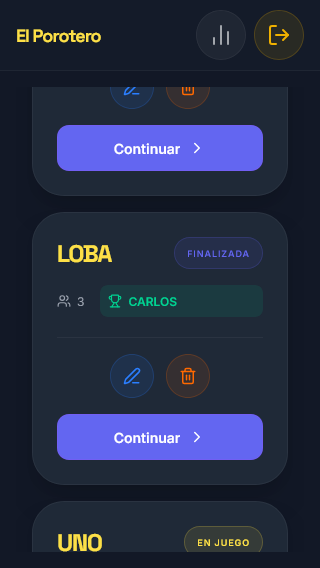
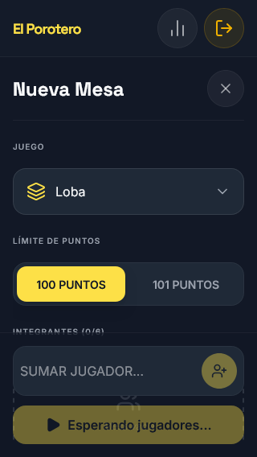
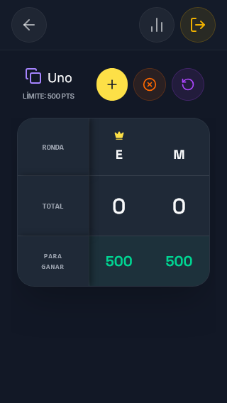

# El Porotero - Sistema de Anotación de Juegos de Cartas

## Descripción General

El Porotero es una aplicación web integral diseñada para la gestión y anotación de puntajes en juegos de cartas tradicionales. El sistema centraliza reglas complejas de múltiples disciplinas, permitiendo un seguimiento preciso de las partidas, historiales de usuarios y estadísticas de rendimiento en tiempo real.

## Arquitectura del Proyecto

Este repositorio utiliza una estructura de **Monorepo** gestionada a través de **npm workspaces**, lo que garantiza la coherencia de tipos y lógica de negocio entre el cliente y el servidor.

### Estructura de Directorios

- `apps/web`: Aplicación cliente desarrollada en React.
- `apps/api`: Servidor RESTful desarrollado en Node.js/Express.
- `packages/shared`: Biblioteca central de interfaces TypeScript, esquemas de validación Zod y lógica de reglas de juego compartidas.

## Stack Tecnológico

### Frontend

- **React 19**: Biblioteca principal para la interfaz de usuario.
- **Vite 8**: Herramienta de construcción y entorno de desarrollo.
- **TypeScript (NodeNext)**: Tipado estático estricto.
- **Tailwind CSS v4**: Framework de diseño centrado en utilidades semánticas.
- **TanStack Query (React Query)**: Gestión de estado del servidor y caché.
- **Framer Motion**: Animaciones y transiciones de interfaz.
- **Radix UI**: Componentes de accesibilidad (Primitivas de diálogo y selección).
- **Sonner**: Sistema de notificaciones reactivas.

### Backend

- **Node.js**: Entorno de ejecución de JavaScript.
- **Express**: Framework para la construcción de la API.
- **MongoDB & Mongoose**: Base de datos NoSQL y modelado de objetos.
- **JWT (JSON Web Tokens)**: Sistema de autenticación y autorización.
- **Zod**: Validación de esquemas en tiempo de ejecución.
- **Bcrypt**: Encriptación de credenciales de seguridad.

## Juegos Soportados y Reglas Implementadas

- **Loba / Chinchón**: Sistema acumulativo con límites configurables (100/101), cierres exclusivos y lógica de re-enganche con penalización.
- **Truco**: Tanteo dinámico por equipos, gestión de etapas (Malas/Buenas) y modo Punta y Hacha automático.
- **Mosca**: Sistema descendente con regla del repartidor obligado y victoria instantánea por bazas.
- **Burako**: Integración de puntos por fichas, canastas puras/impuras, batida y gestión de muerto por equipos.
- **Escoba de 15 / Bársiga**: Tanteo de mesa (Oros, Cartas, Setenta), velos de oro exclusivos y sistema de cantos dinámicos.

## Experiencia de Usuario (Mobile-First)

"El Porotero" fue concebido bajo una filosofía de diseño **Touch-First**, reconociendo que el uso principal de un anotador de puntos ocurre en dispositivos móviles durante la partida.

### Optimización de Interacción
- **Adaptive Interaction**: Los estados de `hover` están restringidos mediante media queries de hardware (`@media (hover: hover)`), evitando el efecto de "botón pegado" en dispositivos táctiles.
- **Haptic Feedback Visual**: Implementación de estados `:active` con escalas de 0.95x y transiciones rápidas (100ms) para simular la respuesta táctica de una aplicación nativa.
- **Dynamic Viewport Height**: Uso de `h-dvh` para garantizar que los botones de acción (como "Confirmar Ronda") siempre estén visibles, independientemente de la barra de navegación del navegador o el teclado en pantalla.
- **Pureza de Diseño**: Interfaz optimizada para una resolución base de 360px, con iniciales de jugadores calculadas dinámicamente (`getShortName`) para evitar el desbordamiento horizontal en mesas de hasta 6 integrantes.

## Galería de Interfaz

| Acceso Seguro | Historial de Partidas | Nuevo Juego | Anotador de Uno |
| :---: | :---: | :---: | :---: |
|  |  |  |  |

### Detalles de Diseño
- **Paleta de Colores**: Concepto *Bodegón Nocturno* (Oscuros profundos con acentos en Amarillo Poroto).
- **Responsive Pro**: Optimizado específicamente para resoluciones de 320px (iPhone SE) hasta 4K.
- **Micro-interacciones**: Feedback háptico visual mediante escalado de componentes en estados activos

## Instalación y Configuración

### Requisitos Previos

- Node.js v20 o superior.
- MongoDB (Local o instancia en la nube).

### Configuración del Entorno

Clonar el repositorio y ejecutar la instalación de dependencias desde la raíz:

```bash
git clone https://github.com/usuario/el-porotero.git
cd el-porotero
npm install
```

### Variables de Entorno

Es necesario configurar los archivos `.env` tanto en `apps/api` como en `apps/web` basándose en los archivos de ejemplo proporcionados:

**Backend (`apps/api/.env`):**

- `PORT`: Puerto de ejecución (Default: 3000).
- `MONGO_URI`: Cadena de conexión a MongoDB.
- `JWT_SECRET`: Llave privada para la firma de tokens.

**Frontend (`apps/web/.env`):**

- `VITE_API_URL`: URL base de la API.

### Entorno de Desarrollo
Para iniciar simultáneamente el servidor de la API y el cliente de Vite, el proyecto utiliza 
la herramienta concurrently, permitiendo monitorear ambos servicios desde una única terminal:

```bash
npm run dev
```

### Scripts Disponibles

Todos los comandos pueden ejecutarse desde la raíz del monorepo:

- `npm run dev`: Inicia tanto el backend como el frontend en modo desarrollo.
- `npm run build`: Compila todos los paquetes y aplicaciones para producción.
- `npm run build:api`: Compila el paquete compartido y el servidor.
- `npm run build:web`: Compila el paquete compartido y genera el bundle estático del frontend.
- `npm run lint`: Ejecuta el análisis estático de código con ESLint.
- `npm run test`: Ejecuta las pruebas unitarias y de integración.

## Pruebas y QA (Postman)

El proyecto incluye una suite de pruebas automatizadas para garantizar la integridad de las reglas de los juegos y la seguridad de los datos.

### Instrucciones de uso:
1. Navega a la carpeta `docs/postman/`.
2. Importa el archivo `el-porotero-v1.json` en tu Postman.
3. Importa el ambiente `local-env.json` y asegúrate de tener seleccionada la variable `base_url`.
4. **Flujo Automatizado**: 
   - Ejecuta la petición `01. Auth / Login`. El script guardará el token JWT automáticamente.
   - Ya puedes ejecutar cualquier petición de `Matches` o `Stats` sin configurar nada más.

### Cobertura de Tests:
- **Contratos de API**: Validación de esquemas JSON para coincidir con el paquete `shared`.
- **Reglas de Juego**: Verificación de cálculos para Loba (acumulativo) y Mosca (descendente).
- **Seguridad**: Verificación de middleware de protección en todas las rutas privadas.

[Ejecutar en Postman](https://martian-eclipse-514495.postman.co/workspace/Team-Workspace~f2d65b89-0cb6-4194-8df8-5f8f94fde9ff/collection/27770697-40942fec-8cd9-466c-b149-905baa6270d0?action=share&source=copy-link&creator=27770697)
[Documentacion On-Line](https://martian-eclipse-514495.docs.buildwithfern.com/el-porotero/auth/login)

## Seguridad

- Implementación de **CORS** para control de dominios permitidos.
- Protección de rutas mediante middleware de verificación de JWT.
- Validación de datos entrantes mediante **Zod** para prevenir inyecciones de datos no estructurados.
- Limitación de peticiones (Rate Limiting) para prevenir ataques de fuerza bruta en los endpoints de autenticación.

## Despliegue

La aplicación está preparada para ser desplegada en arquitecturas modernas (Docker, Vercel/Railway). 

---

© 2026 El Porotero - Documentación técnica oficial - Antonela Borgogno.
